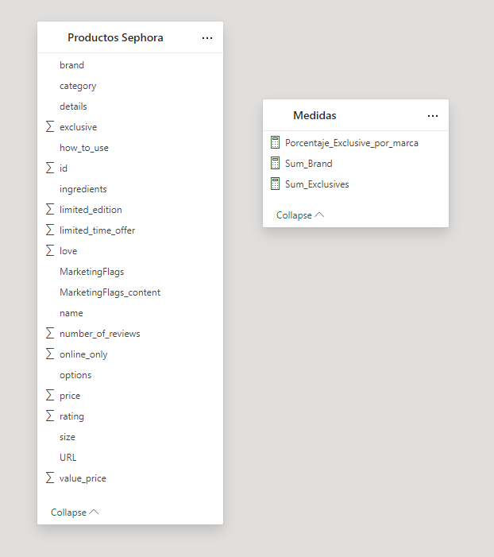
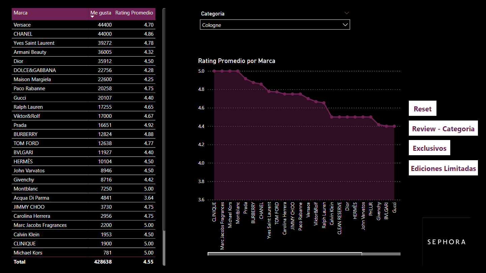
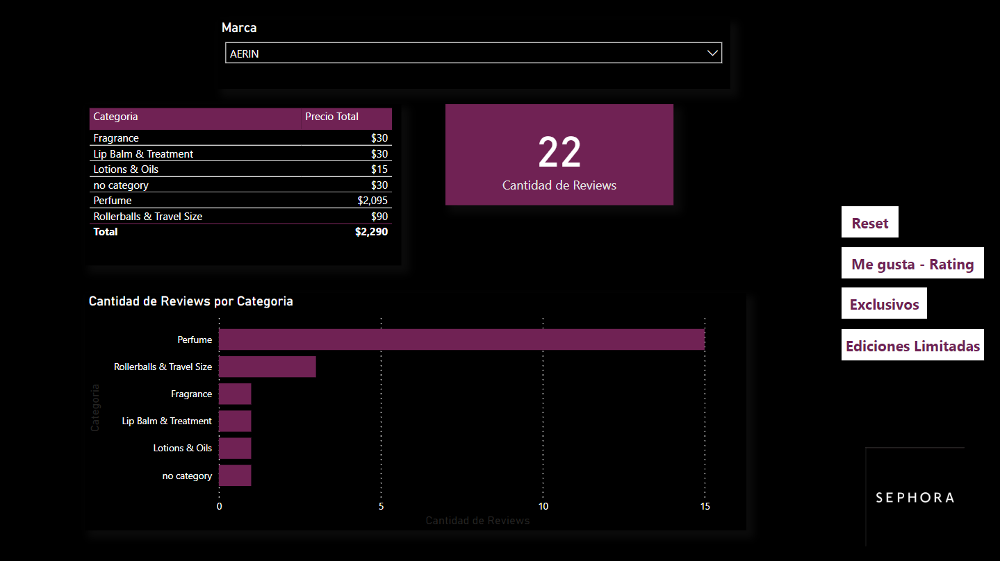
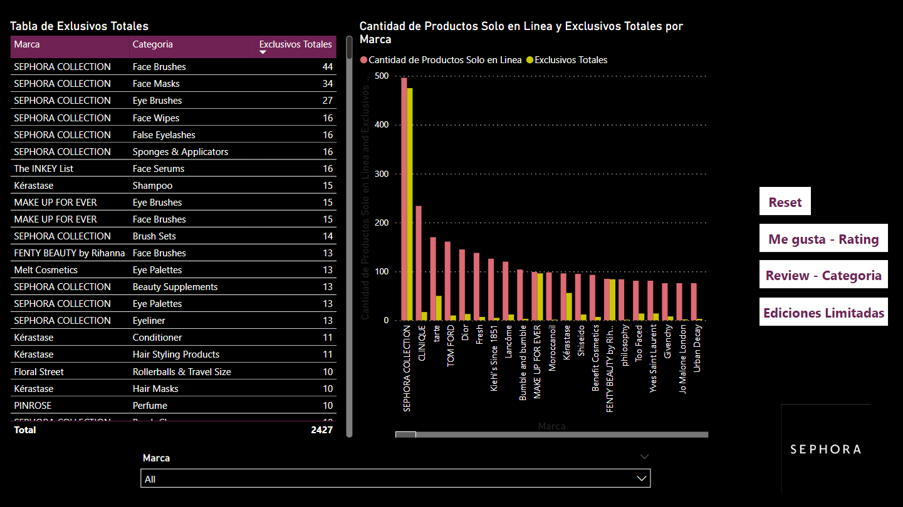
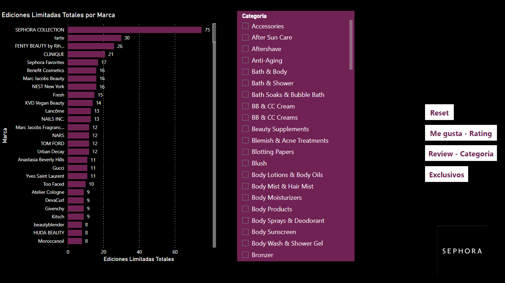

# Reporte de la base de datos de Sephora

Este es un análisis de la base de datos de ventas de productos de Sephora. La base de datos contiene información sobre las ventas de productos de Sephora en diferentes regiones y periodos. El objetivo de este análisis es identificar patrones y tendencias en las ventas de productos de Sephora y proporcionar información útil para la toma de decisiones.

## Dataset 📦

Para este análisis se utilizó el dataset [Sephora Website](https://www.kaggle.com/datasets/raghadalharbi/all-products-available-on-sephora-website?resource=download) de Kaggle. Este dataset contiene información sobre las ventas de productos de Sephora en diferentes regiones y periodos. La base de datos contiene las siguientes columnas:

La base de datos esta estructurada de la siguiente manera:

Diagrama de Tablas de la base de datos

Donde:
Productos Sephora
- **id**: Es el identificador único de cada producto.
- **brand**: Es la marca del producto.
- **category**: Es la categoria a la que pertenece el producto.
- **name**: Es el nombre del producto.
- **size**: Es el tamaño del producto.
- **rating**: Es la calificación del producto.
- **number_of_reviews**: Es el número de reseñas del producto.
- **love**: Es el número de personas que aman el producto
- **price**: Es el precio del producto.
- **value_price**: Es el precio de valor del producto.
- **URL**: Es la URL del producto.
- **MarketingFlags**: Es la bandera de marketing del producto.
- **MarketingFlags_content**: Es el contenido de la bandera de marketing del producto.
- **options**: Son las opciones del producto.
- **details**: Son los detalles del producto.
- **how_to_use**: Es como usar el producto.
- **ingredients**: Son los ingredientes del producto.
- **online_only**: Es si el producto es solo en línea.
- **exclusive**: Es si el producto es exclusivo.
- **limited_edition**: Es si el producto es de edición limitada.
- **limited_time_offer**: Es si el producto es una oferta por tiempo limitado.

Medidas
- **Porcentaje_Exclusive_por_marca**: Es el porcentaje de productos exclusivos por marca.
- **Sum_Brand**: Es la suma de productos por marca.
- **Sum_Exclusives**: Es la suma de productos exclusivos.

Me gusta - Rating

Review - Categoria

Exclusivos

Ediciones Limitadas

Descargar PBIX [aqui](./analisis-sephora.pbix)

## Licencia 📝

Este proyecto está bajo la Licencia AGPLv3 - mira el archivo [LICENSE](LICENSE) para detalles.

## Autor 👨‍💻

  <a href="https://github.com/Dylan-Chambi">
  
  
Dylan Chambi

  </a>

